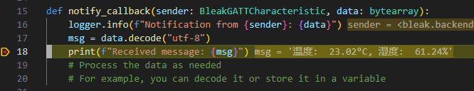
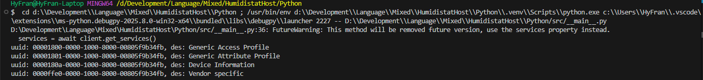

# PC 与 MCU 蓝牙模块 BT-24 通信开发笔记（2025.5.19）

## 初步摸索过程

背景:  PC 利用 Python bleak 库与 MCU 上的 BT-24 蓝牙模块进行通信。

首先 BT-24 模块通电后， PC 此时可以搜索附近蓝牙设备并连接。

为与一个蓝牙设备通信, 蓝牙协议中利用一个地址唯一标识一个蓝牙设备。官方核心规格书是这么写的:

> [1] Volume 3 Host:Part C 15.1. Bluetooth Device address
>
> All Bluetooth devices **shall** have a Bluetooth Device Address (BD\_ADDR) that uniquely identifies the device to another Bluetooth device. The specific Bluetooth Device Address requirements depend on the type of Bluetooth device.
>
> 每个蓝牙设备要有一个蓝牙设备地址, 该地址能在与其他蓝牙设备通信时唯一标识该设备。蓝牙设备地址的规格要求取决于蓝牙设备类型

因此要获取蓝牙设备地址，我们要打开 BT-24 模块让其对外广播，此时回到 PC 上用 bleak 库可以进行以下代码操作

```python
async def main():
    logger.info("Starting...")
  
	#用discover方法, 以默认值秒数持续扫描周围蓝牙设备并返回一个List
    devices = await BleakScanner.discover()
    #此时可利用此list找你要获取的蓝牙设备地址
    for device in devices:
        print(f"Device: {device.name}, Address: {device.address}")
```

获得蓝牙设备地址后, 可以通过以下代码开始写正常的建立通信过程代码了。此处笔者的 BT-24 的地址为`48:87:2D:73:E1:46`​

```python
async def main():
    logger.info("Starting...")

    # 利用蓝牙设备地址, 首先对外持续10秒的寻找，查看蓝牙设备是否在线。
    device = await BleakScanner.find_device_by_address(address, 10)
    # 蓝牙设备不存在时为None
    if device is None:
        logger.error(f"Device with address {address} not found.")
        return
    else:
        logger.info(f"Device found: {device}")
    
    # 定义断开连接的回调函数
    def disconnected_callback(client):
        logger.info("Disconnected from device.")
    # 正式开始建立通信
    async with BleakClient(device, disconnected_callback) as client:
        # ...通信操作...
```

现在我们成功进行了建立与BT24通信，只不过还没有写实际的接发数据。要发数据给 BT-24 数据，我们需要指定它的特征(Characteristic) UUID 才能发送数据。

‍

*蓝牙中特征的解释: 特征是服务(Service)中使用的值，以及关于如何访问该值的属性和配置信息。例如 BT-24 自定义服务下有同时可读写的特征, 和只写特征，这里的特征分别用 UUID 标识 FFE1，FFE2。*

*蓝牙中的服务解释: 服务是数据和行为的集合，用于完成设备的特定或者一部分的功能和特性。例如BT-24厂商提供了自定义的AT指令与串口透传服务的切换和通信服务, 其UUID为FFE0，可用特征UUID指定选择此服务下的哪项功能。*

*一个蓝牙可有多个服务, 而UUID是用来唯一标识它的一种方式或者说是值。*

‍

查询 BT-24 手册可知，BT-24上是以 0xFFE0 服务下的 0xFFE1 和 0xFFE2 的特征进行串口透传的，不过这个值是 16bit 的，实际上蓝牙通信中我们用的是 128bit 的UUID，因此我们要进行转换。转换方式是16-bit是`0000XXXX-0000-1000-8000-00805F9B34FB`​,XXXX替换为这 16bit 的十六进制值, 同理若是 32bit , 则`XXXXXXXX-0000-1000-8000-00805F9B34FB`​具体原理和原因见文章末尾。

此外BT-24的服务是这样在AT 命令模式和透传模式来回切换，见下。

AT 命令模式：模块在未被其他设备连接上的情况下，即为命令模式，可以响应命令。

透传模式：模块被其他设备连接上后即为透传模式，此时可以开始传输数据。

‍

了解了部分知识以及足以进行通信了。不过，要注意，尽管蓝牙在链路层进行了 CRC 的校验，但蓝牙通信依旧是不可靠的，应当在应用层上自己做数据的校验。

```python
# ...其他代码
NOTIFY_WRITE_UUID = "0000FFE1-0000-1000-8000-00805F9B34FB"
WRITE_UUID = "0000FFE2-0000-1000-8000-00805F9B34FB"

def notify_callback(sender: BleakGATTCharacteristic, data: bytearray):
    logger.info(f"Notification from {sender}: {data}")
    msg = data.decode("utf-8")
    print(f"Received message: {msg}")
    # Process the data as needed
    # For example, you can decode it or store it in a variable

  #...其他代码
async def main():
	#...
    def disconnected_callback(client):
        logger.info("Disconnected from device.")
	async with BleakClient(device, disconnected_callback) as client:    
        # 订阅BT-24的回复并传递一个回调函数指针
		await client.start_notify(NOTIFY_WRITE_UUID, notify_callback)
        # 向BT-24发送measure消息到蓝牙上并传给MCU让其测量温湿度并发回, 此时由于已经连接，因此属于串口透传模式
		await client.write_gatt_char(WRITE_UUID, b"measure")
        while True:
            try:
                await asyncio.sleep(10)
            except KeyboardInterrupt:
                logger.info("Disconnecting...")
                break
```

成功接受到MCU上蓝牙模块发回的消息​

## 扩展部分

虽然已经实现了通信需求了，但为进一步了解，我使用了 bleak 查询 BT-24 的所有服务, 发现共有4种服务：1种为 BT-24 厂商自定义的服务，剩下3种是具有官方的规格(specification)的服务。我查询了官方的规格书进行了简单的翻译和校对都在下方。

```python
async with BleakClient(device, disconnected_callback) as client:
    services = await client.get_services()
    for service in services:
        print(f"uuid: {service.uuid}, des: {service.description}")
```

​​

1.  BT-24 自定义的服务 UUID ：0xFFE0
2. 官方定义的服务Device Information：0x180A
3. 官方定义的GAP(Generic Access Profile)服务：0x1800
4. 官方定义的GATT(Gneric Attribute Profile)服务：0x1801

 *[2]官方对部分服务UUID进行了分配可在官方查询*

### GAP

GAP 服务是 GAP 本身的一部分内容。GAP 是每个蓝牙设备都必须实现的配置，并且规定了对一个蓝牙设备的一些基本要求。

在BLE(蓝牙低功耗), GAP定义了四个角色。

1. 广播者(Broadcaster)角色：仅发送数据的应用。支持此角色的设备使用广播方式发送数据，但不支持连接。
2. 观察者(Observer)角色:：仅接收数据的应用。支持此角色的设备可接收广播者通过广播发送的数据，但同样不支持连接。
3. 外设(Peripheral)角色被优化为适用于支持单连接、比中心设备更简单的设备，它在连接中使用链路层的外设角色。
4. 中心(Central)角色支持多个连接，并负责与所有外设设备建立连接，它在连接中使用链路层的中心角色。支持中心角色的设备通常比其他 LE GAP 角色的设备功能更为复杂。

显然此处PC属于中心角色，BT-24属于外设角色

更详细的内容见下面官方的规格书的部分内容

> [1] Volume 1 Part A. Architecture 2.1.1.7. Generic Access Profile
>
> The Generic Access Profile (GAP) block represents the base functionality common to all Bluetooth devices such as modes and access procedures used by the transports, protocols and application profiles. GAP services include device discovery, connection modes, security, authentication, association models and service discovery.
>
> 通用接入配置模块(GAP)代表的是所有蓝牙设备的常见基础功能, 例如由传输层、协议和应用配置文件使用的模式和接入流程。GAP服务包括设备的查找，连接模式，安全性，认证，关联模型和服务的查找.

更加详细的描述是如下

> [1] Volume 1. Part A. Architecture: 6.2 Generic Access Profile
>
> The Bluetooth system defines a base profile which all Bluetooth devices implement. This profile is the Generic Access Profile (GAP), which defines the basic requirements of a Bluetooth device. For instance, for BR/EDR, it defines a Bluetooth device to include the Radio, Baseband, Link Manager, L2CAP, and the Service Discovery protocol functionality; for LE, it defines the Physical Layer, Link Layer, L2CAP, Security Manager, Attribute Protocol and Generic Attribute Profile. This ties all the various layers together to form the basic requirements for a Bluetooth device. It also describes the behaviors and methods for device discovery, connection establishment, security, authentication, association models and service discovery.
>
> 蓝牙系统定义了一个所有蓝牙设备都必须实现的基础配置，称为通用访问配置(GAP)。该配置规定了对蓝牙设备的基本要求。例如：对于 BR/EDR，GAP 将一个蓝牙设备定义为包括射频(Radio)、基带(Baseband)、链路管理器(Link Manager)、逻辑链路控制与适配协议(L2CAP)以及服务发现协议(SDP)功能；对于 LE(低功耗蓝牙)，GAP 包括物理层、链路层、L2CAP、安全管理器、属性协议（ATT）和通用属性配置文件(GATT)。这些层共同构成了一个蓝牙设备的基本功能要求。GAP 还定义了设备发现、连接建立、安全性、身份验证、配对模型和服务发现的方法和行为。
>
> ‍
>
> In BR/EDR, GAP defines a single role with functionality that may be present in each device. This functionality includes how devices discovery each other, establish connections and describes security association models used for authentication. In BR/EDR this functionality may be present in both devices. It may be necessary for a device to implement both the initiating and accepting functionality if the device wants to discover or establish connections with all devices. A device may only include either the initiating or the accepting functionality but it requires the remote device to support the complimentary functionality to discovery or establish connections with the device. For BR/EDR, the Controller is required to support all the functionality, however the Host may limit this functionality based on the other profiles or use cases supported by the device.
>
> 在 BR/EDR 中，GAP 定义了一个可能出现在每个设备的一个功能角色。这些功能包括设备如何发现彼此、建立连接，以及用于身份验证的安全配对模型。在 BR/EDR 中，这些功能可以同时存在于两个设备上。如果一个设备希望能够发现或与所有设备建立连接，则它可能需要同时具备发起方和接受方的功能。一个设备也可以只实现发起或接受其中的一种功能，但这需要另端的设备支持与之互补的功能，才能实现设备发现或建立连接。对于 BR/EDR，控制器(Controller)必须支持所有功能，而主机(Host)可以根据设备所支持的其他配置文件或使用场景限制这些功能。
>
> ‍
>
> In LE, GAP defines four specific roles: Broadcaster, Observer, Peripheral, and Central. A device may support multiple LE GAP roles provided that the underlying Controller supports those roles or role combinations. Each role specifies the requirements for the underlying Controller. This allows for Controllers to be optimized for specific use cases.
>
> 在 LE 中，GAP 定义了四种特定角色：广播者(Broadcaster)、观察者(Observer)、外设(Peripheral)和中心(Central)。只要底层控制器支持，这些角色或其组合都可以被一个设备同时支持。每个角色都规定了底层控制器的要求，从而允许控制器针对特定使用场景进行优化。
>
> ‍
>
> The Broadcaster role is optimized for transmitter only applications. Devices supporting the Broadcaster role use advertising to broadcast data. The Broadcaster role does not support connections. The Observer role is optimized for receiver only applications. Devices supporting the Observer role are the complementary device for a Broadcaster and receives broadcast data contained in advertisements. The Observer role does not support connections. The Peripheral role is optimized for devices that support a single connection and are less complex than Centrals; it uses the Link Layer Peripheral role within the connection. The Central role supports multiple connections and is the initiator for all connections with devices in the Peripheral role; it uses the Link Layer Central role within the connection. Devices supporting the Central role generally support more complex functions compared to the other LE GAP roles.
>
> 广播者(Broadcaster)角色适用于仅发送数据的应用。支持此角色的设备使用广播方式发送数据，但不支持连接。
>
> 观察者(Observer)角色适用于仅接收数据的应用。支持此角色的设备可接收广播者通过广播发送的数据，但同样不支持连接。
>
> 外设(Peripheral)角色被优化为适用于支持单连接、比中心设备更简单的设备，它在连接中使用链路层的外设角色。
>
> 中心(Central)角色支持多个连接，并负责与所有外设设备建立连接，它在连接中使用链路层的中心角色。支持中心角色的设备通常比其他 LE GAP 角色的设备功能更为复杂。

### GATT

同样GATT服务属于GATT的一部分。每个低功耗蓝牙设备都要实现此配置，经典蓝牙设备不是必须实现它的。

> [1] Volume 1 Part A. Architecture 2.1.1.6. Generic Attribute Profile
>
> The Generic Attribute Profile (GATT) block represents the functionality of the ATT Server and, optionally, the ATT Client. The profile describes the hierarchy of services, characteristics and attributes used in the ATT Server. The block provides interfaces for discovering, reading, writing and indicating of service characteristics and attributes. GATT is used on LE devices for LE profile service discovery.
>
> 通用属性配置文件(GATT)模块代表ATT服务器, 可选地包含ATT客户端的功能。此配置描述了ATT服务器关于服务，特征(characteristics)和属性(attributes)的层次结构。这个模块提供用于对服务特性和属性的查找，读，写和指示接口。GATT只用在低功耗(LE)设备的LE配置的服务查找上

更加详细的描述

> [1]Volume 1 Part A. Architecture 6.4.2. Generic Attribute Profile
>
> Generic Attribute Profile (GATT) is built on top of the Attribute Protocol (ATT) and establishes common operations and a framework for the data transported and stored by the Attribute Protocol. GATT defines two roles: Server and Client. A GATT Client or Server is an ATT Client or Server respectively that conforms to the requirements in GATT. The GATT roles are not necessarily tied to specific GAP roles but may be specified by higher layer profiles. GATT and ATT are not transport specific and can be used in both BR/EDR and LE. However, GATT and ATT are mandatory to implement in LE since it is used for discovering services.
>
> 通用属性配置文件(GATT)建立在属性协议(ATT)之上，定义了用于传输和存储数据的通用操作和框架。GATT 定义了两个角色：服务器和客户端。GATT 客户端或服务器分别是符合 GATT 要求的 ATT 客户端或服务器。GATT角色不一定与特定的GAP角色绑定，也可以由更高层的配置文件来指定。GATT 和 ATT 与传输方式无关，因此可以在BR/EDR和LE中使用。然而，GATT和ATT在LE中是强制实现的，因为它们用于服务发现。
>
> ‍
>
> GATT also specifies the format of data contained on the GATT Server. Attributes, as transported by the Attribute Protocol, are formatted as Services and Characteristics. Services may contain a collection of characteristics. Characteristics contain a single value and any number of descriptors describing the characteristic value.
>
> GATT 还规定了 GATT 服务器中数据的格式。ATT 协议传输的属性以 服务和 特征(Characteristic)的形式组织。服务可以包含一组特征，而特征包括一个单一的值，以及任意数量用于描述该特征值的描述符(Descriptors)。
>
> ‍
>
> With the defined structure of services, characteristics and characteristic descriptors a GATT Client that is not specific to a profile can still traverse the GATT Server and display characteristic values to the user. The characteristic descriptors can be used to display descriptions of the characteristic values that may make the value understandable by the user.
>
> 由于服务、特征和描述符所形成的结构，即使一个 GATT 客户端不是为特定配置文件设计的，它仍然可以访问GATT服务器并显示特征值。特征描述符(Descriptors)可用于展示特征值的说明，让用户能够理解这些值的含义。

### Device Information服务

这个服务似乎不是必须实现的，笔者在蓝牙核心规范Core Specification 6.1手册并没有搜索到有关此的任何介绍。

作用如下

> [3] 1. Introduction
>
> The Device Information Service exposes manufacturer and/or vendor information about a device.
>
> 设备信息(DI)服务用于向外暴露生产商或者销售商信息
>
> This service uses GATT and therefore has no additional transport dependencies.
>
> 这个服务依赖GATT进行传输, 因此没依赖其他的传输服务

### BT24自定义的服务

BT24自己定义的服务0xFFE0下有特征(characteristics):

	UUID: 0xFFE1, 描述是TX & RX

	UUID: 0xFFE2, 描述的是TX

### UUID

UUID 正如前文所述，它被用来唯一标识一个事物。蓝牙通信中实际上16-bit和32-bit都代表的是一个128-bit UUID值。

蓝牙的 UUID 的基 UUID 被称为 Bluetooth_Base_UUID, 值是00000000-0000-1000-8000-00805F9B34FB, 这段UUID后缀标识的是蓝牙设备的UUID。

> ###### [1] Volume 3. Host: Part B 2.5.1. UUID
>
> A UUID is a universally unique identifier that is expected to be unique across all space and all time (more precisely, the probability of independently-generated UUIDs being the same is negligible). UUIDs can be independently created in a distributed fashion. No central registry of assigned UUIDs is required. A UUID is a 128-bit value.
>
> UUID 是一个通用唯一标识符，它的被设计为在所有空间和所有时间中保持唯一性(更准确地说，是指独立生成的 UUID 相同的概率可以忽略不计）。UUID 可以以分布式的方式独立生成，不需要任何中心注册机构来分配 UUID。UUID 是一个 128 位的值。
>
> ‍
>
> To reduce the burden of storing and transferring 128-bit UUID values, a range of UUID values has been pre-allocated for assignment to often-used, registered purposes. The first UUID in this pre-allocated range is known as the Bluetooth\_Base\_UUID and has the value 00000000-0000-1000-8000-00805F9B34FB. UUID values in the pre-allocated range have aliases that are represented as 16-bit or 32-bit values. These aliases are often called 16-bit and 32-bit UUIDs, but each actually represents a 128-bit UUID value.
>
> 为减少存储和传输 128 位 UUID 值的负担，有一段UUID，用于分配给常用的、已注册的用途。这个预分配范围中的第一个UUID被称为Bluetooth_Base_UUID，其值为：00000000-0000-1000-8000-00805F9B34FB处于这一预分配范围内的 UUID 值具有别名以16位或32位值的形式表示。这些别名通常被称为 16 位 和 32 位 的UUID，但实际上它们每一个都代表一个完整的 128 位 UUID 值。
>
> ‍
>
> The full 128-bit value of a 16-bit or 32-bit UUID may be computed by a simple arithmetic operation.
>
> 128\_bit\_value \= 16\_bit\_value × 2<sup>96</sup> + Bluetooth\_Base\_UUID
>
> 128\_bit\_value \= 32\_bit\_value × 2<sup>96</sup> + Bluetooth\_Base\_UUID
>
> 16位或32位对应的完整的128位UUID可以用以下简单的算术计算:
>
> 128\_bit\_value \= 16\_bit\_value × 2<sup>96</sup> + Bluetooth\_Base\_UUID
>
> 128\_bit\_value \= 32\_bit\_value × 2<sup>96</sup> + Bluetooth\_Base\_UUID
>
> ‍
>
> A 16-bit UUID may be converted to 32-bit UUID format by zero-extending the 16-bit value to 32-bits. An equivalent method is to add the 16-bit UUID value to a zero-valued 32-bit UUID.
>
> 一个 16 位 UUID 可以通过将该 16 位值用零扩展(zero-extend)到32位来转换到32位。另一种等效的方法是将 16 位 UUID 值加到一个值为零的 32 位 UUID 上。
>
> ‍
>
> Note: Two 16-bit UUIDs may be compared directly, as may two 32-bit UUIDs or two 128-bit UUIDs. If two UUIDs of differing sizes are to be compared, the shorter UUID must be converted to the longer UUID format before comparison.
>
> 注意: 两个 16 位 UUID 可以直接比较, 两个 32 位UUID也可以直接比较，两个128 位 UUID也同样。如果要比较两个不同长度的 UUID，必须先将较短的 UUID 转换为较长的 UUID 格式后再进行比较。

## 参考

[1] [Bluetooth Core Specification v6.1](https://www.bluetooth.com/wp-content/uploads/Files/Specification/HTML/Core-61/out/en/index-en.html)

[2] [Assigened Number Service UUID](https://bitbucket.org/bluetooth-SIG/public/src/main/assigned_numbers/uuids/service_uuids.yaml)

[3] [Device Information Service Specification](https://www.bluetooth.com/specifications/specs/dis-1-2/)

‍